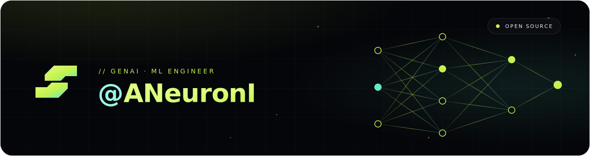

<div align="center">
  
</div>

<br/>

```python
class ANeuronI:
    def __init__(self):
        self.name       = "ANeuronI"
        self.role       = "GenAI / ML Engineer"
        self.education  = "B.Tech, CS with Artificial Intelligence, NSUT"
        self.languages  = ["Python", "C++", "TypeScript", "SQL"]
        self.frameworks = ["Next.js", "FastAPI", "LangGraph", "vLLM"]
        self.ml_stack   = ["PyTorch", "Transformers", "QLoRA", "XGBoost", "scikit-learn"]
        self.cloud      = ["AWS", "Azure", "GCP Vertex AI", "Docker", "GitHub Actions"]
        self.projects   = ["Project-Celia", "OIverse", "Sign-language", "RAG-AGENT"]
        self.hobbies    = ["astronomy", "competitive gaming", "music"]
        self.playing    = "Call of Duty"   # when the GPU is free

    def __str__(self):
        return f"{self.name} | {self.role}"
```

### `~/ stack`


### `~/ activity`

<div align="center">
  
</div>

### `~/ reach`

[](mailto:reachme@arxshore.com)

<br/>

<div align="center">
  
</div>
